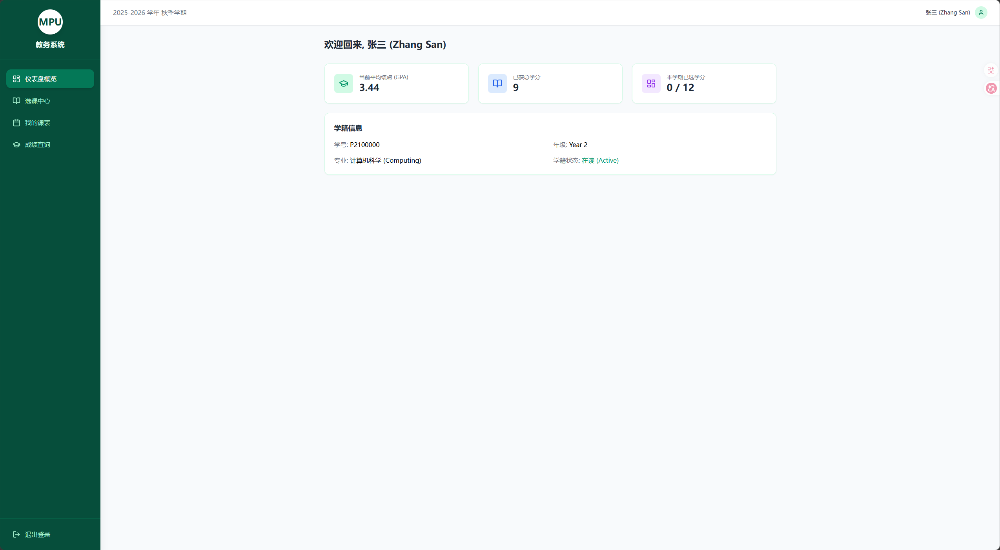

# 🎓 MPU Course Management System
**COMP2116: Software Engineering - Final Project**

 
> **Graphical Abstract Description**: A modern, rule-based academic management prototype designed specifically for the Macao Polytechnic University (MPU) community.

---

## 📌 1. Purpose & Vision

### 🚀 Target Market
This project delivers an intuitive and streamlined course registration portal for students at Macao Polytechnic University (MPU). It aims to solve the complex navigation and interaction challenges often found in traditional academic systems, enhancing the overall user experience during peak enrollment periods.

### ⚙️ Development Methodology
We adopted the **Agile Development** model to manage this project.

* **Rapid Iteration**: Unlike the Waterfall model, Agile allows for continuous adjustments based on testing. It enabled us to rapidly refine UI interactions, optimize our state management, and ensure the software's validation rules meet rigorous academic expectations.

---

## 🎯 2. Features & Implementation

### ✨ Key Features
* ✅ **Intelligent Registration**: Real-time course validation, capacity checking, and conflict resolution.
* ✅ **Dynamic Dashboard**: Auto-calculation of student GPAs and acquired credits based on historical records.
* ✅ **Visual Timetable (New!)**: An interactive weekly schedule view that automatically maps and organizes enrolled courses into a responsive grid.
* ✅ **Detailed Course Syllabus**: Interactive modal windows providing in-depth course descriptions, prerequisites, and instructor details.
* ✅ **Secure Access**: Route protection and identity verification via a dedicated Authentication Module.

### 🧠 Core Algorithm
The system utilizes a **Rule-Based Validation Algorithm**. It aggregates structured data—including maximum credit limits, historical grades, and real-time course capacity—to strictly enforce academic policies (e.g., intercepting over-credit enrollment and full-class registrations) through synchronous logical reasoning.

---

## 📅 3. Development Plan & Team

### 🔄 Sprint History
* **Sprint 1**: Requirement analysis and high-fidelity UI prototyping.
* **Sprint 2**: Development of core business logic (registration validation, credit logic).
* **Sprint 3**: Comprehensive functional testing and UI refinement.
* **Sprint 4**: Implementation of the secure Authentication Module and route protection.
* **Sprint 5**: Developed the visual Timetable Grid and detailed Syllabus Modals to enhance UI/UX completeness.

### 👥 Members & Roles
| Name | Student ID | Roles & Responsibilities | Contribution |
| :--- | :--- | :--- | :--- |
| **Xu Rui** | p2421552 | Project Manager, Front-end Developer, Core Logic | 35% |
| **Sun Donghao** | p2421132 | Back-end Developer, Database Administration | 35% |
| **Xu Zhengchi** | p2421336 | Front-end Developer, UI Design | 10% |
| **Wang Jingqi** | p2421584 | Back-end Developer, Database Administration | 10% |
| **Zhang Junwei** | p2214320 | Front-end Developer, UI Design | 10% |

### 🕒 Milestones
* **April 14, 2026**: Environment setup and foundational framework.
* **April 16, 2026**: Completion of registration logic and styling.
* **April 18, 2026**: Core feature stabilization and GitHub deployment.

---

## 🛠️ 4. Tech Stack & Environment

### 💻 Frameworks & Tools
* **Languages**: JavaScript (ES6+), HTML5, CSS3
* **Frameworks**: React.js, Tailwind CSS (v3)
* **Libraries**: Lucide-React

### ⚙️ System Requirements
| Type | Requirement |
| :--- | :--- |
| **Runtime** | Node.js v18+ |
| **Browser** | Google Chrome (Recommended) |

---

## 📊 5. Status & Roadmap

### 📈 Current Status
* **Pilot Stage**: Core functionalities are fully demonstrable and stable.

### 🔮 Future Roadmap
* **Persistence**: Integrate a backend database (e.g., Firebase) for user data storage.
* **Administration**: Develop a dedicated interface for teacher-side course management.

---

## 🎥 6. Demonstration

📺 **Demo Video**: [Insert Your YouTube Link Here]

---

## 📜 7. Declaration
This project was developed using React and Vite. UI styling utilizes the open-source Tailwind CSS framework. All business logic codes and validation algorithms were originally developed by the project team.

---
**Authors**: MPU COMP2116 Team | **Last Updated**: April 2026